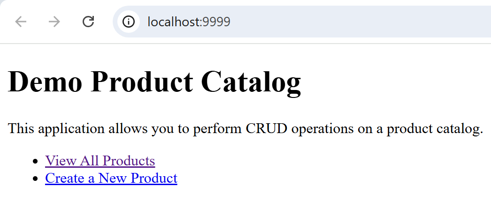
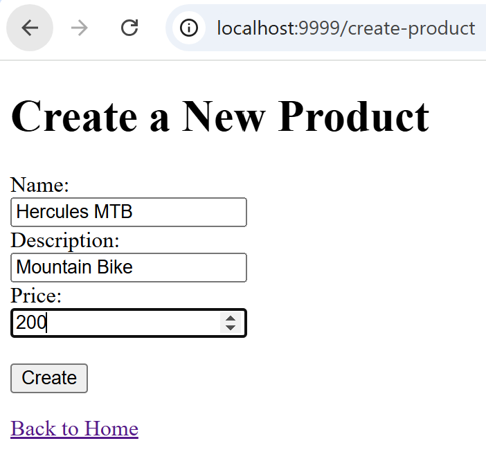
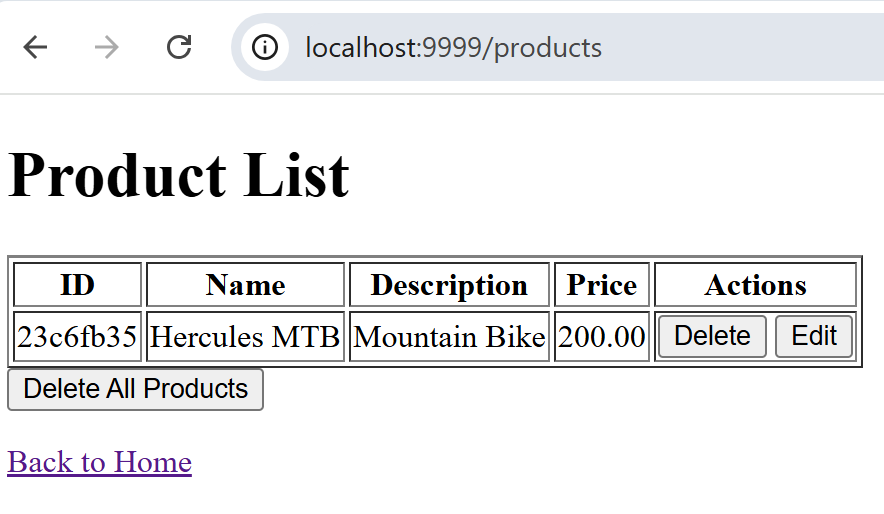

# About

The `demo-webapp-flask-dynamodb` is a simple webapp container image that uses [Flask](https://flask.palletsprojects.com/en/stable/) and [Amazon DynamoDB](https://docs.aws.amazon.com/amazondynamodb/latest/developerguide/Introduction.html) to create a demo product catalog web application. This is a lightweight webapp intended for **testing** container infrastructure and web application infrastructure deployments (e.g. Amazon ECS, Load Balancers).

# Usage

### Option 1 : Use your AWS CLI default profile
```
docker run \
    -e AWS_DEFAULT_PROFILE=<profile> \
    -v ~/.aws:/root/.aws \
    -p <host_port>:5000 \
    ghcr.io/cybergavin/demo-webapp-flask-dynamodb:latest
```
where `<profile>` is the name of your AWS CLI default profile in `~/.aws/cofig`

### Option 2 : Use your AWS CLI credentials
```
docker run \
        -e AWS_ACCESS_KEY_ID=<access key ID> \
        -e AWS_SECRET_ACCESS_KEY=<secret access key> \
        -e AWS_DEFAULT_REGION=<region>
        -p <host_port>:5000 \
         ghcr.io/cybergavin/demo-webapp-flask-dynamodb:latest
```

# Example

```
docker run -e AWS_DEFAULT_PROFILE=myprofile -v ~/.aws:/root/.aws -p 9999:5000 ghcr.io/cybergavin/demo-webapp-flask-dynamodb:latest
```

Some screenshots of the webapp running after the above command are shown below.


<br />
<br />
